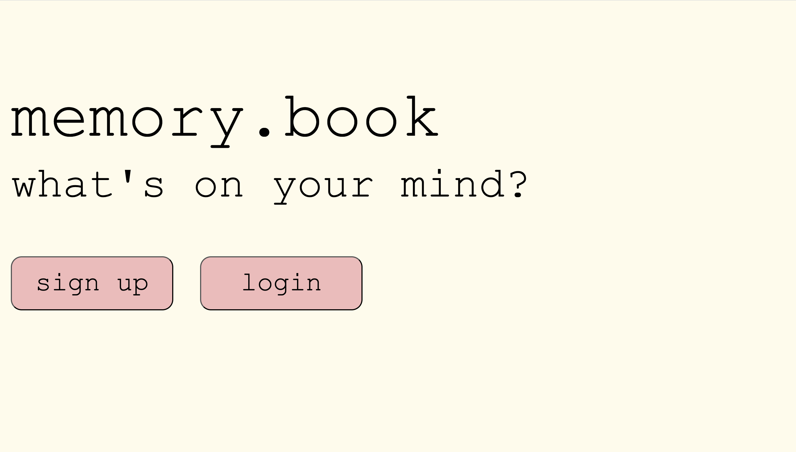
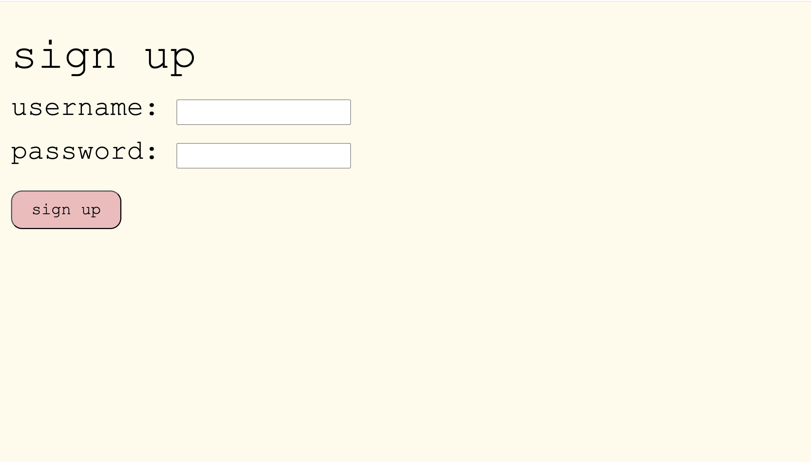
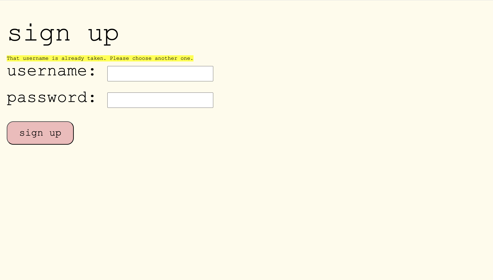
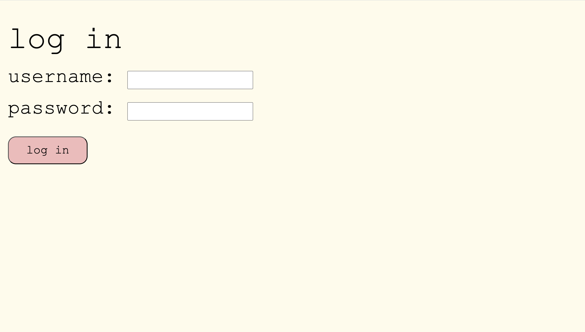
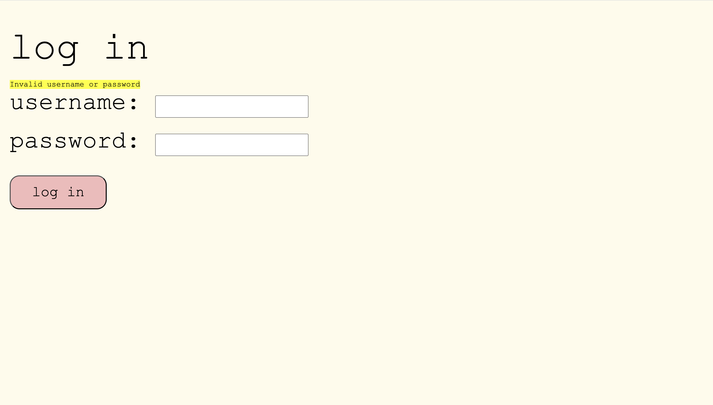
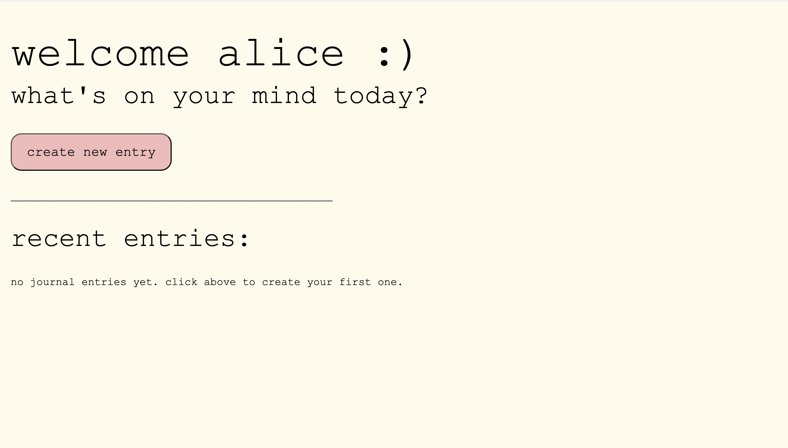
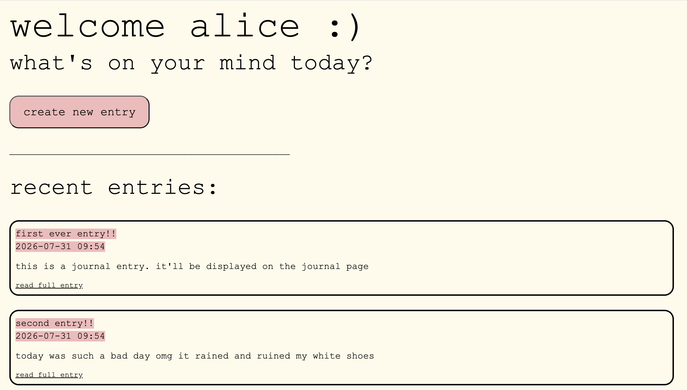
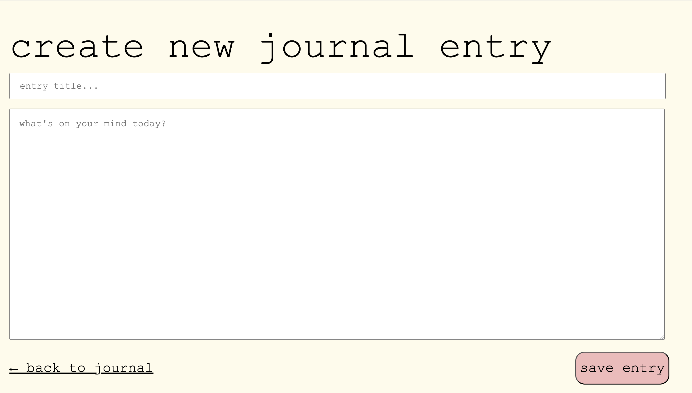
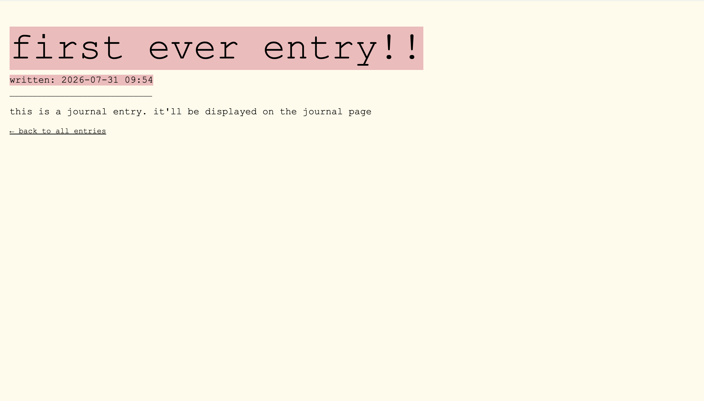

# memory.book: A digital journal
## Introduction
This website is a digital journal where users can create accounts, write automatically time-stamped journal entries and look back on previous entries. The idea behind the creation of this website was to build an easy way to keep track of things while on the go - instead of having to lug a physical journal around everywhere, users would be able to easily and effortlessly note down their thoughts or experiences.

## Installation
To successfully run the code, you must first:
- install requirements.txt (pip install requirements.txt)
- create and activate a virtual environment (python -m venv venv followed by source venv/bin/activate)

## A Tour Through the Website
### Home Page

This is the first page the user views upon opening the website. The two buttons provide options to either sign up (if the user is new) or log in (if the user already has an account).

### Signup Page

This is the signup page. Users are prompted to enter a username and a password. The entered username is checked against a database of all current usernames and passwords (i.e. all the 'taken' ones). If the username is already in use, an error message is flashed telling the user to choose another username (see below).

### Login Page

This is the login page. Users are prompted to enter a username and a password, which are then checked against the database of usernames and passwords. If no match is found (i.e. a username and corresponding password) an error message is flashed telling the user their username and/or password is invalid (see below).

### Journal Page

This is the journal page. The welcome message is customised to the username (in this case, alice) and the 'create new entry' button directs users to the create entry page (will discuss later). Under 'recent journal entries', entries are displayed with title, timestamp, text, and a button to read the full entry (will also discuss later). The page automatically updates to reflect new entries. The image below shows the page of a user called alice with two entries.

### Create New Entry Page

This page allows users to create a new entry. They are prompted for a title and given space to write the main body of their entry. The 'back to journal' button in the bottom left takes them back to the journal page. The 'save entry' button saves the title and content of the entry (along with the username of the user and the automatically generated date/time stamp for the article) and redirects the user back to the journal page, which updates to reflect the new entry.

### View Entry Page

If a user clicks 'read full entry' for an entry on the journal page, it redirects them to this page, where they can read the full entry (sorry for the repetition - it's all in the name). The 'back to all entries' link directs the user back to the journal page.